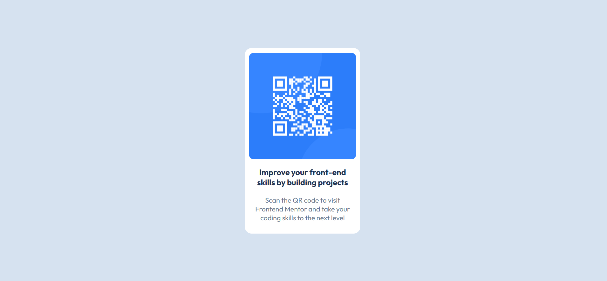

# Frontend Mentor - QR code component solution

This is a solution to the [QR code component challenge on Frontend Mentor](https://www.frontendmentor.io/challenges/qr-code-component-iux_sIO_H). Frontend Mentor challenges help you improve your coding skills by building realistic projects. 

## Table of contents

- [Overview](#overview)
  - [Screenshot](#screenshot)
  - [Links](#links)
- [My process](#my-process)
  - [Built with](#built-with)
  - [What I learned](#what-i-learned)
  - [Continued development](#continued-development)
  - [Useful resources](#useful-resources)
- [Author](#author)

**Note: Delete this note and update the table of contents based on what sections you keep.**

## Overview

### Screenshot




### Links

- Solution URL: [https://github.com/Joy-Akinleye/qr-code-component-main]
- Live Site URL: [https://qr-code-component-main-three-steel.vercel.app/]

## My process

### Built with

- Semantic HTML5 markup
- CSS custom properties
- Flexbox


### What I learned

- I learnt how to create variables for css colors and how to call the variables.
- I learnt how to center a div by centering its parent elements

```css
:root {
    --white: hsl(0, 0%, 100%);
    --Slate300: hsl(212, 45%, 89%);
    --Slate500: hsl(216, 15%, 48%);
    --Slate900: hsl(218, 44%, 22%);
    --main-font: 'outfit';
}
body {
    margin: 0;
    height: 100vh;
    display: flex;
    justify-content: center;
    align-items: center;
}
```

### Continued development

I would continue to do more projects on FrontEnd mentor. And upskill even to Javascript and react.

### Useful resources

- [Google Fonts](https://fonts.google.com/specimen/Outfit) - This helped me to add the Outfit font externally. 


## Author

- Website - [Joy Akinleye](github.com/Joy-Akinleye)
- Frontend Mentor - [@Joy-Akinleye](https://www.frontendmentor.io/profile/Joy-Akinleye)
- Twitter - [@yourusername](https://www.twitter.com/yourusername)
